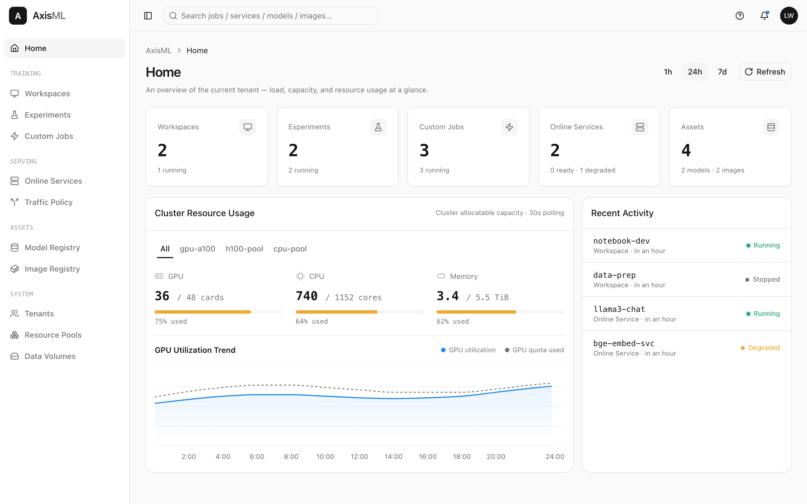

<p align="center">
  
</p>

<p align="center">
  <strong>The Kubernetes-native platform for the full machine learning lifecycle.</strong><br>
  Distributed training · elastic inference · multi-tenant quota scheduling · artifact management — on one control plane.
</p>

<p align="center">
  <a href="https://github.com/AxisML/axisml/actions/workflows/ci.yml"></a>
  
  
  
  <a href="LICENSE"></a>
</p>

<p align="center">
  <a href="#why-axisml">Why AxisML</a> ·
  <a href="#architecture">Architecture</a> ·
  <a href="#quick-start">Quick Start</a> ·
  <a href="#components">Components</a> ·
  <a href="#development">Development</a> ·
  <a href="#documentation">Docs</a>
</p>

<p align="center">
  <strong>English</strong> · <a href="README.zh-CN.md">简体中文</a>
</p>

---

**AxisML** is a Kubernetes-native ML platform that manages the entire model lifecycle — development, distributed training, artifact management, online inference, and operations — behind one coherent control plane. It pairs a clean tenant/quota model with a self-built elastic scheduler (`axisml-scheduler`, built on [scheduler-plugins](https://github.com/kubernetes-sigs/scheduler-plugins)) so teams share GPU capacity without stepping on each other, and routes every workload — native Jobs, Kubeflow trainers, KServe inference — through a single quota-enforced scheduling path.

<p align="center">
  
</p>

> [!WARNING]
> **AxisML is in early, active development.** APIs, CRDs, and Helm values change
> frequently and without notice. Not yet recommended for production — expect
> breaking changes between commits. See [Project Status](#project-status).

## Why AxisML

- **🏢 Multi-tenancy that's actually enforced.** Every tenant maps to an isolated Namespace with a `ElasticQuota`. There is *no* scheduling path that bypasses quota — every workload Pod is pinned to `axisml-scheduler` by construction.
- **⚡ Elastic GPU sharing.** ElasticQuota lets idle capacity flow to whoever needs it, then reclaims it under contention — high utilization without static partitioning.
- **🧩 Pluggable training & serving backends.** One `MLRun`/`MLService` API dispatches to `native` (Job / Deployment / StatefulSet + gang-scheduled `PodGroup`), `kubeflow-trainer` (PyTorchJob / TFJob / MPIJob), `kserve` (`InferenceService`), or a `custom` GVK — without changing the user-facing contract.
- **📦 First-class artifacts.** Models, datasets, images, and eval reports addressed by `(namespace, kind, name, version)`, backed by OCI (zot) and S3 (RustFS). Clients stream bytes directly from storage — the registry never proxies large blobs.
- **🎛️ Declarative, layered delivery.** Three Helm charts (infra → system → platform), CRDs as the cluster source of truth, PostgreSQL as the business authority — continuously reconciled between them.
- **🔬 Built to be tested.** Unit + envtest/testcontainers integration tests (plus a manual real-cluster e2e suite), generated OpenAPI specs verified in CI, and pre-commit/pre-push hooks that keep the monorepo honest.

## Architecture

AxisML splits into three deployable layers, each shipped as its own Helm chart and installed bottom-up (**infra → system → platform**). Only the Platform layer is exposed; everything below it is internal and trusts the identity Platform propagates.

<p align="center">
  
</p>


**Key invariants**

- **`namespace` *is* the tenant identifier** across compute-service and artifact-hub — no separate tenant lookup at the edge.
- **PostgreSQL is authoritative, CRs are derived.** compute-service owns the `tenants` table and continuously reconciles the cluster-scoped `Tenant` CR from it; operators read `spec` and write only `status`.
- **Operators don't know about each other.** tenant-operator never reads `MLRun`/`MLService`; compute-operator never reads `Tenant`/`ElasticQuota` (it only passes the quota name through).
- **No quota bypass.** Every backend-derived Pod sets `schedulerName: axisml-scheduler` and carries the `scheduling.axisml.io/quota` label — there is no scheduling path around ElasticQuota.
- **Only Platform is exposed.** System services accept internal calls and trust the `X-Axisml-User` identity header.

See the [High-Level Design](docs/high_level_design.md) for the full picture, and each layer's README — [Platform](axisml-platform/) · [System](axisml-system/) · [Infra](axisml-infra/) — for the details.

## Quick Start

> **Prerequisites:** Docker Desktop, [minikube](https://minikube.sigs.k8s.io/), `kubectl`, [Helm](https://helm.sh/), and Go 1.26+.

```bash
# 1. Spin up a local cluster (minikube profile "axisml")
make cluster-up
make cluster-status

# 2. Install AxisML — three charts in dependency order (infra → system → platform)
make helm-install                 # install/upgrade all three, in order
make helm-template                # render all charts locally (dry run)
make helm-uninstall               # tear down, platform → system → infra
#   or one layer at a time:
make -C axisml-infra helm-install # also: -C axisml-system / -C axisml-platform

# 3. Run the tests
make test                         # unit tests across every component (no cluster needed)
make integration-test             # envtest + testcontainers integration tests (needs Docker)

make help                         # discover every available target
```

Full walkthrough — setup, build/test, and the testing layers (unit / integration / manual e2e via `make e2e-test`) — lives in the [Development Workflow](docs/development_workflow.md).

## Components

AxisML is a monorepo of independent Go modules grouped into the three layers. Each layer dir has its own README.

| Component | Layer | What it does |
| --- | --- | --- |
| **[platform](axisml-platform/)** | Platform | Go BFF + React frontend. The only externally exposed entry point; holds the user → tenant-view mapping and orchestrates the system services. _(backend is currently a contract-only shell generating `axisml-platform/docs/apis/platform.yaml`; frontend scaffolded)_ |
| **[cluster-manager](axisml-system/cluster-manager/)** | System | Stateless REST shell over the cluster-scoped `ResourcePool` CRD (with inline `spec.units[]`). No PG, no reconciler — Kubernetes etcd is the source of truth. |
| **[compute-service](axisml-system/compute-service/)** | System | REST service and business authority for **Tenant / Quota / Job / Service / Workspace**, with PG as the sole source of truth. Emits `Tenant` / `MLRun` / `MLService` CRs and reads back status. |
| **[tenant-operator](axisml-system/tenant-operator/)** | System | Reconciles the `Tenant` CR into a Namespace, `ElasticQuota`, and per-tenant Secret / ConfigMap / ServiceAccount / RBAC. |
| **[compute-operator](axisml-system/compute-operator/)** | System | Reconciles `MLRun` / `MLService` / `MLTrafficPolicy` via a dispatcher + handler model (`native`, `kubeflow-trainer`, `kserve`, `custom`). All derived Pods route through `axisml-scheduler`. |
| **[artifact-hub](axisml-system/artifact-hub/)** | System | Registry for models, datasets, images, and eval reports, addressed by `(namespace, kind, name, version)`. PG holds metadata; bytes live in zot (OCI) and RustFS (S3). |

**Infrastructure** ([`axisml-infra`](axisml-infra/) chart): Envoy Gateway, RustFS, zot, axisml-scheduler, NVIDIA GPU Operator, kube-prometheus-stack, and PostgreSQL. See the [infra design](axisml-infra/docs/system_design/overview.md).

## Development

```bash
make build               # build every component
make fmt vet             # before every commit
make install-hooks       # pre-commit + pre-push hooks (pre-commit framework)
make doc-gen             # regenerate OpenAPI specs from Go DTOs
make doc-test            # verify specs match Go types (CI guard)
make coverage            # unit + integration coverage, merged into coverage/coverage.out
```

Things that bite if you don't know them:

- **Each component is its own Go module** with a sibling `test/integration/` submodule — `go test ./...` from the root won't traverse everything; use the `make` targets (or `make -C <layer> ...` for per-layer work).
- **OpenAPI specs are generated, not hand-written.** After changing a handler signature or DTO in `cluster-manager` / `compute-service` / `artifact-hub` / `platform/backend`, run `make doc-gen` before committing. The pre-commit hook does *not* watch Platform backend DTOs — run `make -C axisml-platform doc-gen` yourself there.
- **Conventional Commits, scoped to a layer** — `feat(infra|system|platform|lite)` plus the cross-cutting `build` / `repo` / `deps`; enforced by commitlint on commits and PR titles.
- **External CRDs** the operators import (scheduler-plugins' `ElasticQuota`, scheduler-plugins' `PodGroup`, …) are vendored under `axisml-system/test/crds/external/`.

Architecture notes and gotchas live in [CLAUDE.md](CLAUDE.md); contributor conventions in [AGENTS.md](AGENTS.md) and [CONTRIBUTING.md](CONTRIBUTING.md).

## Documentation

- **[High-Level Design](docs/high_level_design.md)** — start here (core concepts, feature matrix, full architecture)
- **By layer** — [Platform](axisml-platform/) · [System](axisml-system/) · [Infra](axisml-infra/) — each layer dir has a `README.md`, a design overview at `docs/system_design/overview.md`, and per-component docs
- **Cross-cutting** — [Deployment manual](docs/deployment.md) · [Development Workflow](docs/development_workflow.md) (per-layer DB schema lives under each `<layer>/docs/system_design/database.md`)
- **OpenAPI specs** — generated REST contracts under each layer's `docs/apis/` ([system](axisml-system/docs/apis) · [platform](axisml-platform/docs/apis))
- **Frontend design system** — [DESIGN.md](DESIGN.md) (Vercel Geist style)

## Project Status

AxisML is in **early, active development**. The system design lives ahead of the code — when code and the design docs disagree, the design doc is usually the intended target. See the [feature matrix](docs/high_level_design.md) for current design coverage.

## Contributing

Contributions are welcome! Before opening a PR:

1. Read [CONTRIBUTING.md](CONTRIBUTING.md) and [AGENTS.md](AGENTS.md) for commit style (Conventional Commits) and PR expectations.
2. Run `make install-hooks` once per clone — hooks enforce formatting, vetting, and doc/spec sync.
3. Make sure `make test` passes; add an integration happy-path alongside unit tests for new behavior.

## License

AxisML is licensed under the [Apache License 2.0](LICENSE). By submitting a pull request, you agree that your contribution is licensed under Apache 2.0 (per section 5 of the license).
