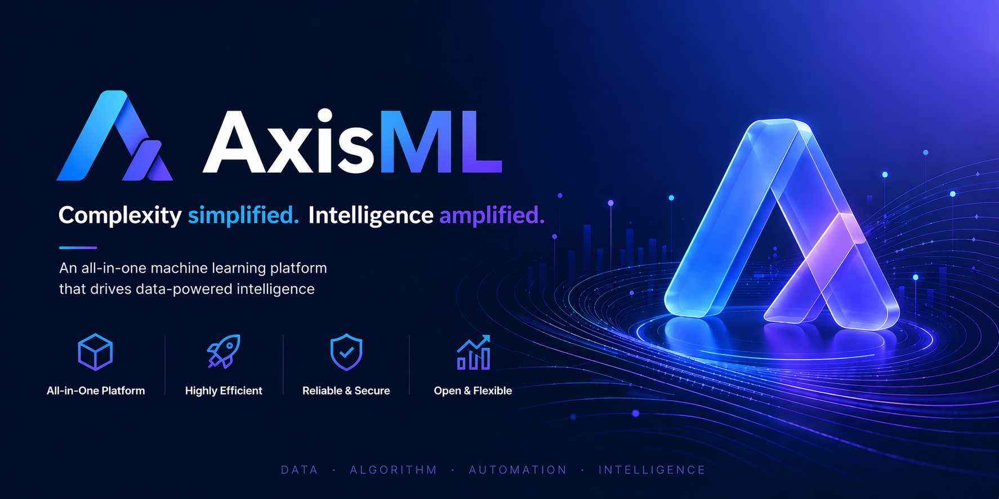

<p align="center">
  
</p>

AxisML is a machine learning platform with native support for distributed training, intelligent resource scheduling, and elastic scaling. Manages the full model lifecycle from development and training to inference and operations.

## Quick Start

### Set up local development cluster

```bash
# Start a local Kubernetes cluster (requires Docker Desktop and minikube)
make cluster-up

# Check cluster status
make cluster-status

# See all available commands
make help
```

For detailed setup instructions, see [Local Development Environment Setup](docs/development/local-setup.md).

### Install AxisML services

AxisML ships as two Helm charts: `axisml-infra` (third-party infrastructure) and
`axisml-system` (control plane + metadata DB). Install infra first.

```bash
# Install both (infra then system)
make helm-install

# Or install/upgrade one layer at a time
make helm-install-infra    # also: helm-install-system / helm-upgrade-infra / helm-upgrade-system

# Render both charts locally (dry run)
make helm-template

# Uninstall (system first, then infra)
make helm-uninstall
```

## Components

AxisML is a monorepo split into independent Go modules, deployed together via the `axisml-system` Helm chart. The system is organized into three layers: a **cluster-vocabulary layer** (admin's K8s write abstraction), a **tenant + workload layer** (business authority in PG, derived CRs), and a **view layer** (the user-facing entry point).

**Cluster-vocabulary layer**
- **[cluster-manager](docs/system_design/components/cluster-manager.md)** — stateless REST shell over the cluster-scoped `ResourcePool` CRD (with inline `spec.units[]`). Collapses admin's Kubernetes write operations (pool CRUD, unit add/remove) into a stable REST contract. No PG, no reconciler, no leader election; Kubernetes etcd is the source of truth, and compute-service consumes the CRD directly via an Informer.

**Tenant + workload layer**
- **[compute-service](docs/system_design/components/compute-service.md)** — REST service and business authority for the **Tenant / Quota / Job / Service / Workspace** domains, with PG as the sole source of truth. Holds the `tenants` table as the Tenant authority, deriving and continuously reconciling the cluster-level `Tenant` CR; emits `MLJob` / `MLService` CRs for workloads and reads back CR status. Resolves `(poolName, unitName)` against the `ResourcePool` CRD via Informer.
- **[tenant-operator](docs/system_design/components/tenant-operator.md)** — reconciles the `Tenant` CR (emitted by compute-service) into a per-tenant Namespace, namespace-scoped Koordinator `ElasticQuota` from `Tenant.spec.quotas[]`, and per-tenant Secret / ConfigMap / ServiceAccount / RBAC.
- **[compute-operator](docs/system_design/components/compute-operator.md)** — reconciles `MLJob` and `MLService` via a dispatcher + handler model. Backends include `native` (Job / Deployment / StatefulSet + scheduler-plugins `PodGroup`), `kubeflow-trainer` (PyTorchJob / TFJob / MPIJob / ...), `kserve` (`InferenceService`), and `custom`. All backend-derived Pods route through `koord-scheduler` for ElasticQuota enforcement.
- **[artifact-hub](docs/system_design/components/artifact-hub.md)** — registry for models, datasets, images, evaluation reports. Addressed by `(namespace, kind, name, version)`; does not interpret namespace semantics. PG is the metadata authority; bytes live in zot (OCI) and RustFS (S3) and are accessed directly by clients, not proxied.

**View layer**
- **[platform](docs/system_design/components/platform.md)** — Go backend (BFF) + React frontend. The only externally exposed entry point; holds the user → tenant-view mapping and orchestrates calls to cluster-manager / compute-service / artifact-hub, passing user identity via the `X-Axisml-User` header. Currently a scaffold.

**Infrastructure** (separate `axisml-infra` chart): Envoy Gateway, RustFS, zot, Koordinator (ElasticQuota + koord-scheduler), GPU Operator, kube-prometheus-stack. See [infra design](docs/system_design/infra.md).

See the [System Design Overview](docs/system_design/overview.md) for how these fit together.

### Run tests

```bash
make test                # unit tests across all components
make integration-test    # integration tests (envtest + testcontainers, needs Docker)
```

See [Testing Guide](docs/development/testing.md) for the two-layer test pyramid.

### Install git hooks

```bash
make install-hooks       # installs pre-commit + pre-push hooks via the pre-commit framework
```

- **pre-commit** (fast): `gofmt`, hygiene checks, `go vet` on touched modules, `make doc-test`
  when a Go file in `cluster-manager` / `compute-service` / `artifact-hub` changes, and
  `make helm-lint` when chart files change.
- **pre-push**: `golangci-lint` and `go test -short` on touched Go modules.

### Generate API docs

The three HTTP-surface services (`cluster-manager`, `compute-service`, `artifact-hub`) generate
their OpenAPI specs from Go DTOs into [`docs/openapi/`](docs/openapi/). Regenerate after
changing a handler signature or DTO — the `doc-test` hook above enforces this.

```bash
make doc-gen                       # regenerate all three specs
make compute-service-doc-gen       # or just one
make doc-test                      # verify specs match Go types (CI guard)
```

## Documentation

- [System Design Overview](docs/system_design/overview.md)
- Component designs: [tenant-operator](docs/system_design/components/tenant-operator.md) · [compute-operator](docs/system_design/components/compute-operator.md) · [cluster-manager](docs/system_design/components/cluster-manager.md) · [compute-service](docs/system_design/components/compute-service.md) · [artifact-hub](docs/system_design/components/artifact-hub.md) · [platform](docs/system_design/components/platform.md) · [infra](docs/system_design/infra.md)
- [Local Development Setup](docs/development/local-setup.md)
- [Testing Guide](docs/development/testing.md)
