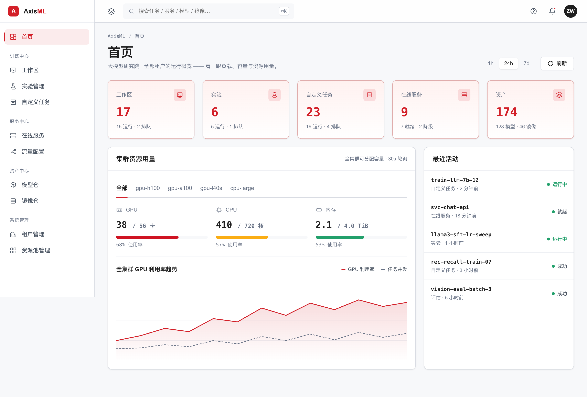
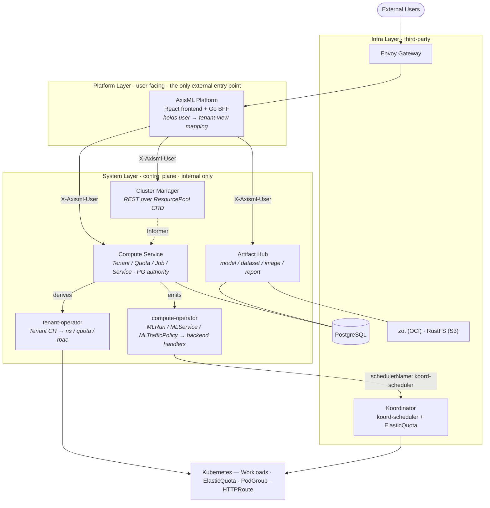

<p align="center">
  
</p>

<p align="center">
  <strong>The Kubernetes-native platform for the full machine learning lifecycle.</strong><br>
  Distributed training · elastic inference · multi-tenant quota scheduling · artifact management — on one control plane.
</p>

<p align="center">
  <a href="https://github.com/AxisML/axisml/actions/workflows/ci.yml"></a>
  
  
  
  <a href="LICENSE"></a>
  <a href="#contributing"></a>
</p>

<p align="center">
  <a href="#why-axisml">Why AxisML</a> ·
  <a href="#architecture">Architecture</a> ·
  <a href="#quick-start">Quick Start</a> ·
  <a href="#components">Components</a> ·
  <a href="#documentation">Docs</a> ·
  <a href="#contributing">Contributing</a>
</p>

---

**AxisML** is a Kubernetes-native ML platform that manages the entire model lifecycle — development, distributed training, artifact management, online inference, and operations — behind one coherent control plane. It pairs a clean tenant/quota model with [Koordinator](https://koordinator.sh) elastic scheduling so teams share GPU capacity without stepping on each other, and routes every workload — native Jobs, Kubeflow trainers, KServe inference — through a single quota-enforced scheduling path.

<p align="center">
  
</p>

> [!WARNING]
> **AxisML is in early, active development.** APIs, CRDs, and Helm values change
> frequently and without notice. Not yet recommended for production — expect
> breaking changes between commits. See [Project Status](#project-status).

## Why AxisML

- **🏢 Multi-tenancy that's actually enforced.** Every tenant maps to an isolated Namespace with a Koordinator `ElasticQuota`. There is *no* scheduling path that bypasses quota — every workload Pod is pinned to `koord-scheduler` by construction.
- **⚡ Elastic GPU sharing.** ElasticQuota lets idle capacity flow to whoever needs it, then reclaims it under contention — high utilization without static partitioning.
- **🧩 Pluggable training & serving backends.** One `MLRun`/`MLService` API dispatches to `native` (Job / Deployment / StatefulSet + gang-scheduled `PodGroup`), `kubeflow-trainer` (PyTorchJob / TFJob / MPIJob), `kserve` (`InferenceService`), or a `custom` GVK — without changing the user-facing contract.
- **📦 First-class artifacts.** Models, datasets, images, and eval reports addressed by `(namespace, kind, name, version)`, backed by OCI (zot) and S3 (RustFS). Clients stream bytes directly from storage — the registry never proxies large blobs.
- **🎛️ Declarative, GitOps-friendly.** Three layered Helm charts (infra → system → platform), CRDs as the cluster source of truth, PostgreSQL as the business authority — with continuous reconciliation between them.
- **🔬 Built to be tested.** Unit + envtest/testcontainers integration tests (plus a manual real-cluster e2e suite), generated OpenAPI specs verified in CI, and pre-commit/pre-push hooks that keep the monorepo honest.

## Architecture

AxisML separates responsibility into three deployable layers — **Platform** (the only externally exposed entry point), **System** (the self-built control plane), and **Infra** (third-party infrastructure) — each shipped as its own Helm chart.



**Key invariants**

- **`namespace` *is* the tenant identifier** across compute-service and artifact-hub — no separate tenant lookup at the edge.
- **PostgreSQL is authoritative, CRs are derived.** compute-service owns the `tenants` table and continuously reconciles the cluster-level `Tenant` CR from it.
- **Operators don't know about each other.** tenant-operator never reads `MLRun`/`MLService`/`MLTrafficPolicy`; compute-operator never reads `Tenant`/`ElasticQuota` (it only passes the quota name through).
- **Only Platform is exposed.** System services accept internal calls and trust the `X-Axisml-User` identity header.

See the [System Design Overview](docs/system_design/high_level_design.md) for the full picture.

## Quick Start

> **Prerequisites:** Docker Desktop, [minikube](https://minikube.sigs.k8s.io/), `kubectl`, [Helm](https://helm.sh/), and Go 1.26+.

### 1. Spin up a local cluster

```bash
make cluster-up          # minikube profile "axisml"
make cluster-status      # verify it's healthy
make help                # discover every available target
```

Full walkthrough: [Local Development Environment Setup](docs/development/local-setup.md).

### 2. Install AxisML

AxisML ships as three Helm charts installed in dependency order — `axisml-infra` (third-party infra + metadata DB) → `axisml-system` (CRDs + control-plane services) → `axisml-platform` (user-facing entry point).

```bash
make helm-install        # install/upgrade all three, in order

# or one layer at a time:
make helm-install-infra  # also: helm-install-system / helm-install-platform
make helm-template       # render all charts locally (dry run)
make helm-uninstall      # tear down, platform → system → infra
```

### 3. Run the tests

```bash
make test                # unit tests across every component (no cluster needed)
make integration-test    # envtest + testcontainers integration tests (needs Docker, ~30–60s)
```

See the [Testing Guide](docs/development/testing.md) for the full testing layers (unit / integration / manual e2e via `make e2e-test`).

## Components

AxisML is a monorepo of independent Go modules organized into three layers.

| Component | Layer | What it does |
| --- | --- | --- |
| **[platform](docs/system_design/platform/backend.md)** | View | Go BFF + React frontend. The only externally exposed entry point; holds the user → tenant-view mapping and orchestrates the system services. _(backend is currently a contract-only shell generating `docs/openapi/platform.yaml`; frontend scaffolded)_ |
| **[cluster-manager](docs/system_design/system/cluster-manager.md)** | Cluster vocab | Stateless REST shell over the cluster-scoped `ResourcePool` CRD (with inline `spec.units[]`). No PG, no reconciler — Kubernetes etcd is the source of truth. |
| **[compute-service](docs/system_design/system/compute-service.md)** | Tenant + workload | REST service and business authority for **Tenant / Quota / Job / Service / Workspace**, with PG as the sole source of truth. Emits `Tenant` / `MLRun` / `MLService` CRs and reads back status. |
| **[tenant-operator](docs/system_design/system/tenant-operator.md)** | Tenant + workload | Reconciles the `Tenant` CR into a Namespace, Koordinator `ElasticQuota`, and per-tenant Secret / ConfigMap / ServiceAccount / RBAC. |
| **[compute-operator](docs/system_design/system/compute-operator.md)** | Tenant + workload | Reconciles `MLRun` / `MLService` / `MLTrafficPolicy` via a dispatcher + handler model (`native`, `kubeflow-trainer`, `kserve`, `custom`). All derived Pods route through `koord-scheduler`. |
| **[artifact-hub](docs/system_design/system/artifact-hub.md)** | Tenant + workload | Registry for models, datasets, images, and eval reports, addressed by `(namespace, kind, name, version)`. PG holds metadata; bytes live in zot (OCI) and RustFS (S3). |

**Infrastructure** (`axisml-infra` chart): Envoy Gateway, RustFS, zot, Koordinator, NVIDIA GPU Operator, kube-prometheus-stack, and PostgreSQL. See the [infra design](docs/system_design/infra/overview.md).

## Development

```bash
make build               # build every component
make fmt vet             # before every commit
make install-hooks       # pre-commit + pre-push hooks (pre-commit framework)
make doc-gen             # regenerate OpenAPI specs from Go DTOs
make doc-test            # verify specs match Go types (CI guard)
```

- **Each component is its own Go module** with a sibling `test/integration/` submodule — `go test ./...` from the root won't traverse everything; use the `make` targets.
- **OpenAPI specs are generated, not hand-written.** After changing a handler signature or DTO in `cluster-manager` / `compute-service` / `artifact-hub` / `platform/backend`, run `make doc-gen` before committing.
- **External CRDs** the operators import (Koordinator's ElasticQuota, scheduler-plugins' PodGroup, …) are vendored under `test/crds/external/`.

Architecture notes and gotchas live in [CLAUDE.md](CLAUDE.md); contributor conventions in [AGENTS.md](AGENTS.md).

## Documentation

- **[System Design Overview](docs/system_design/high_level_design.md)** — start here
- **By layer** — [Platform](docs/system_design/platform/overview.md) · [System](docs/system_design/system/overview.md) · [Infra](docs/system_design/infra/overview.md) (each layer dir has an `overview.md` + per-component docs)
- **Cross-cutting** — [database](docs/system_design/database.md) · [deployment](docs/system_design/deployment.md)
- **Guides** — [Local Development Setup](docs/development/local-setup.md) · [Testing Guide](docs/development/testing.md)
- **[OpenAPI specs](docs/openapi)** — generated REST contracts

## Project Status

AxisML is in **early, active development**. The system design lives ahead of the code — when code and `docs/system_design/` disagree, the design doc is usually the intended target. See the [feature matrix](docs/system_design/high_level_design.md#3-功能矩阵) for current design coverage.

## Contributing

Contributions are welcome! Before opening a PR:

1. Read [AGENTS.md](AGENTS.md) for commit style (Conventional Commits) and PR expectations.
2. Run `make install-hooks` once per clone — hooks enforce formatting, vetting, and doc/spec sync.
3. Make sure `make test` passes; add an integration happy-path alongside unit tests for new behavior.

## License

AxisML is licensed under the [Apache License 2.0](LICENSE).

Contributions are accepted under the same license — by submitting a pull request, you agree that your contribution is licensed under Apache 2.0 (per section 5 of the license).
