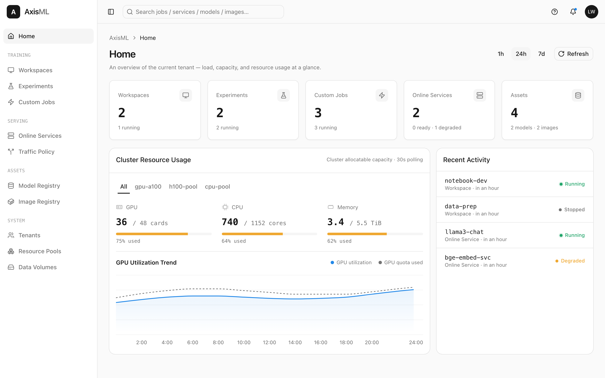
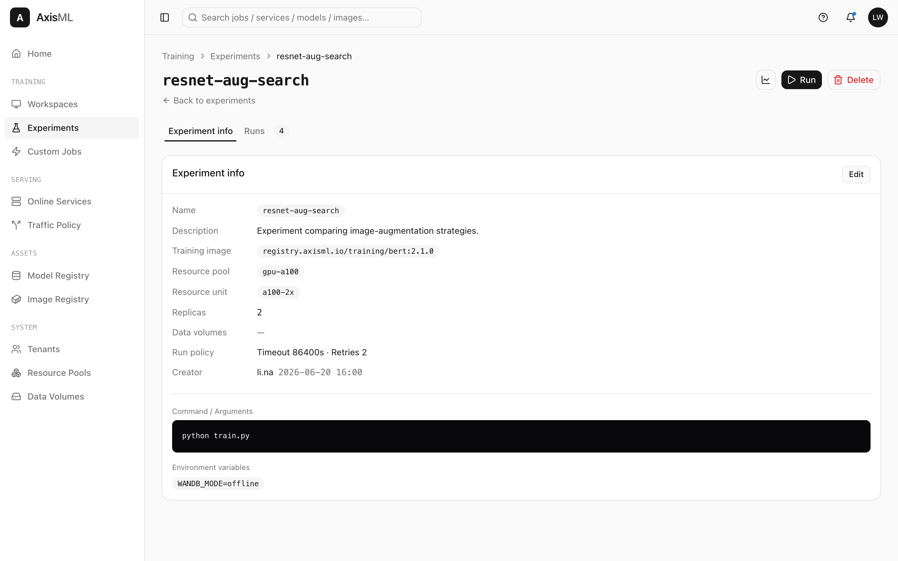
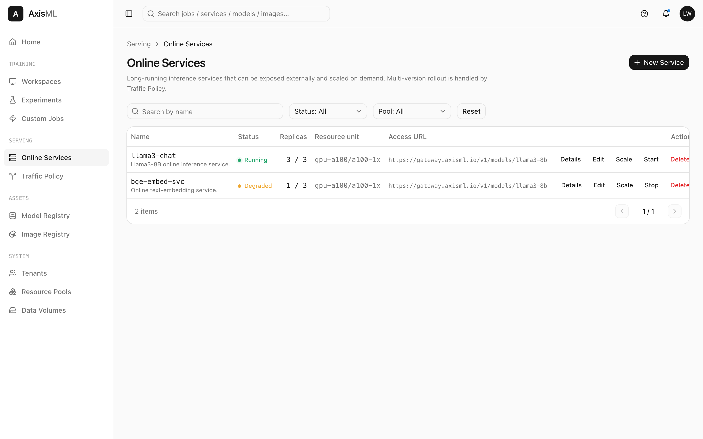
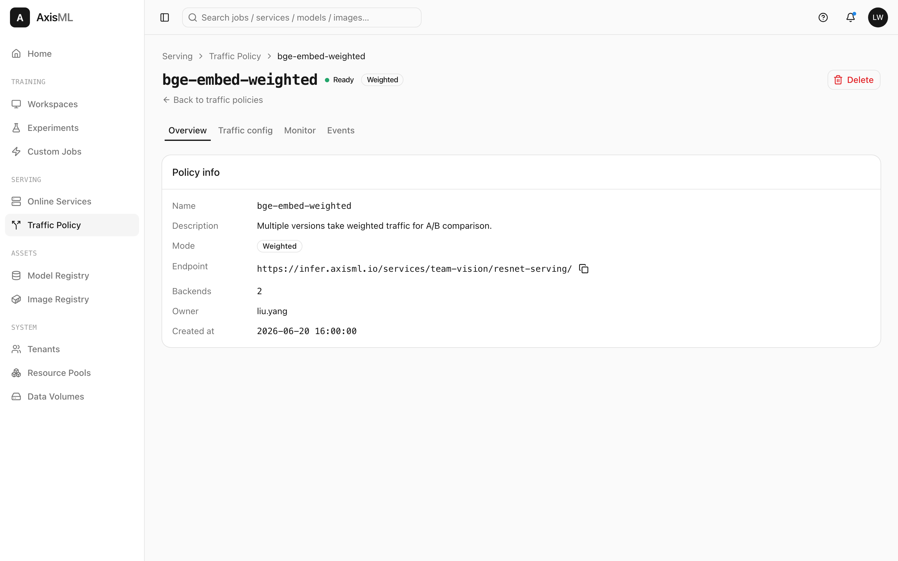
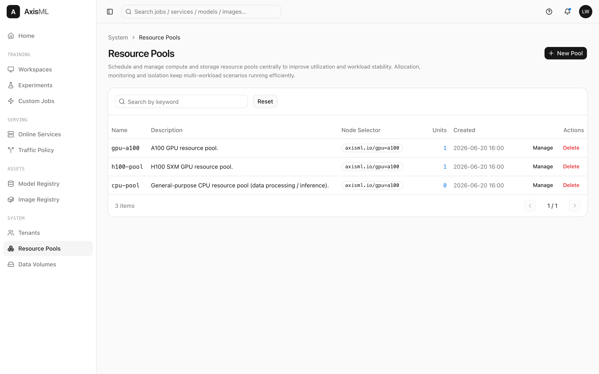

<p align="center">
  
</p>

<p align="center">
  <strong>An open-source ML platform for teams that share GPUs.</strong><br>
  Workspaces · distributed training · online inference · model & image registry · multi-tenant quotas — one control plane, on Kubernetes or a single Docker host.
</p>

<p align="center">
  <a href="https://github.com/AxisML/axisml/actions/workflows/ci.yml"></a>
  
  
  
  <a href="LICENSE"></a>
</p>

<p align="center">
  <a href="#-highlights">Highlights</a> ·
  <a href="#-quick-start">Quick Start</a> ·
  <a href="#-features">Features</a> ·
  <a href="#-architecture">Architecture</a> ·
  <a href="#-documentation">Docs</a> ·
  <a href="#-contributing">Contributing</a>
</p>

<p align="center">
  <strong>English</strong> · <a href="README.zh-CN.md">简体中文</a>
</p>

---

**AxisML** gives ML teams a single place to develop, train, version, and serve
models on shared GPU infrastructure. Platform admins carve the cluster into
resource pools and tenant quotas; data scientists get notebooks, experiments,
jobs, and inference services in a web console — and every workload goes through
one quota-enforced scheduling path, so no team can starve another.

<p align="center">
  
</p>

> [!WARNING]
> **AxisML is in early, active development.** APIs, CRDs, and Helm values may
> change without notice between commits. Great for evaluation and contributions;
> not yet recommended for production.

## ✨ Highlights

| | |
| --- | --- |
| 🏢 **Multi-tenancy with real enforcement** | Each tenant gets its own isolated scope and per-pool quota. Every workload Pod is pinned to `axisml-scheduler` by construction — there is **no scheduling path that bypasses quota**. |
| ⚡ **Elastic GPU sharing** | Built on [scheduler-plugins](https://github.com/kubernetes-sigs/scheduler-plugins) `ElasticQuota`: idle capacity flows to whoever needs it and is reclaimed under contention — high utilization without static partitioning. Gang scheduling via `PodGroup` for distributed jobs. |
| 🧩 **One API, pluggable engines** | A single `MLRun` / `MLService` contract dispatches to native Kubernetes (Job, Deployment, StatefulSet), **Kubeflow Trainer** (PyTorchJob / TFJob / MPIJob), **KServe**, or any custom CRD — swap backends without changing how users submit work. |
| 🚦 **Canary & blue-green out of the box** | `MLTrafficPolicy` puts one stable endpoint in front of multiple model services and splits traffic by weight through Envoy Gateway. |
| 📦 **Built-in artifact registry** | Models, images, and datasets are versioned per tenant and stored in OCI (zot) and S3 (RustFS). Clients stream bytes directly from storage — the registry never proxies large blobs. |
| 🐳 **Kubernetes *or* a single Docker host** | The same product ships two ways: three Helm charts for clusters, or a Compose stack that runs workloads as Docker containers. Same UI, same API, same test suite. |

## 🚀 Quick Start

### Option 1 — Try it on one machine (Standalone, ~5 minutes)

All you need is **Docker** and **make**.

```bash
git clone https://github.com/AxisML/axisml.git && cd axisml
make standalone-up        # builds images and starts the Compose stack
```

Open **http://localhost:8080** and sign in with `admin` / `admin` (you'll be
asked to change the password on first login). The internal System API listens on
`:8090`.

```bash
make standalone-down              # stop (CLEAN=1 also drops data volumes)
make standalone-delete            # purge the stack and every AxisML-managed container/volume
```

Optional extras: `make standalone-up PROFILES="storage gateway"` adds RustFS (S3)
and Envoy Gateway for service routing. See the [Standalone guide](axisml-standalone/)
for GPU configuration and runtime limits.

### Option 2 — Deploy on Kubernetes

> **Prerequisites:** Docker, [minikube](https://minikube.sigs.k8s.io/) (or any
> cluster), `kubectl`, and [Helm](https://helm.sh/).

```bash
make cluster-up           # local minikube cluster (profile "axisml"); skip on an existing cluster
make helm-install         # installs three charts in order: infra → system → platform
make helm-uninstall       # tears down in reverse order
```

The [Deployment manual](docs/deployment.md) covers values, image tags,
per-layer installs, and production notes.

### Kubernetes vs. Standalone

| | Kubernetes | Standalone |
| --- | --- | --- |
| Best for | Shared multi-node GPU clusters | Evaluation, dev boxes, single GPU servers |
| Packaging | 3 Helm charts (infra / system / platform) | 1 Docker Compose project |
| Workloads run as | Pods via `axisml-scheduler` + ElasticQuota | Docker containers with built-in quota admission |
| Training / serving engines | native, Kubeflow Trainer, KServe, custom | native (job / deployment / statefulset) |
| UI, API, data model | ✅ identical | ✅ identical |

## 🧭 Features

| Area | What you get |
| --- | --- |
| **Training** | Workspaces (interactive dev environments), experiments with run history & TensorBoard, reusable job templates, priority queueing, distributed training |
| **Serving** | Online inference services with partial rollout & scaling, weighted traffic policies for canary / blue-green |
| **Assets** | Versioned model and container-image registry, per-tenant or public visibility |
| **Administration** | Tenants & members (system-admin / tenant-admin / user roles), resource pools & resource units, per-pool quotas, data volumes, cluster dashboard |

<table>
  <tr>
    <td><p align="center"><sub>Experiments & runs</sub></p></td>
    <td><p align="center"><sub>Inference services</sub></p></td>
  </tr>
  <tr>
    <td><p align="center"><sub>Traffic splitting</sub></p></td>
    <td><p align="center"><sub>Resource pools & quotas</sub></p></td>
  </tr>
</table>

## 🏗 Architecture

AxisML is split into three layers. Only the **Platform** layer is exposed to
users; everything below it is internal.

<p align="center">
  
</p>

| Layer | Components | Role |
| --- | --- | --- |
| **Platform** | [backend + frontend](axisml-platform/) | The only external entry point: React console, REST API, auth & RBAC, tenant views, job / experiment / model definitions. |
| **System** | [cluster-manager](axisml-system/cluster-manager/) · [compute-service](axisml-system/compute-service/) · [artifact-hub](axisml-system/artifact-hub/) · [tenant-operator](axisml-system/tenant-operator/) · [compute-operator](axisml-system/compute-operator/) | Control plane: resource pools & tenants, workload admission and lifecycle, artifact metadata, and the operators that turn `Tenant` / `MLRun` / `MLService` / `MLTrafficPolicy` CRs into real resources. |
| **Infra** | [axisml-infra](axisml-infra/) | PostgreSQL, `axisml-scheduler`, Envoy Gateway, zot (OCI), RustFS (S3), NVIDIA GPU Operator, kube-prometheus-stack. |

Design principles that hold everywhere:

- **No quota bypass.** Every backend-derived Pod sets `schedulerName: axisml-scheduler` and carries the `scheduling.axisml.io/quota` label.
- **PostgreSQL is authoritative, CRs are derived.** Services persist desired state and reconcile CRs from it; operators read `spec` and write only `status`.
- **Loosely coupled operators.** `tenant-operator` and `compute-operator` never read each other's resources.
- **Deployment modes are not forks.** Kubernetes and Standalone swap only the resource provider and runtime; domain logic, OpenAPI, and UI exist once.

Read the [High-Level Design](docs/high_level_design.md) for the full picture.

## 📚 Documentation

| Topic | Where |
| --- | --- |
| System overview — concepts, invariants, feature matrix | [High-Level Design](docs/high_level_design.md) |
| Installing & configuring | [Deployment manual](docs/deployment.md) · [Configuration reference](docs/configuration.md) · [Standalone](axisml-standalone/) |
| Per-layer design | [Platform](axisml-platform/) · [System](axisml-system/) · [Infra](axisml-infra/) |
| REST API (generated OpenAPI) | [Platform](axisml-platform/docs/apis) · [System](axisml-system/docs/apis) · [Standalone](axisml-standalone/docs/apis) |
| Building, testing, contributing | [Development Workflow](docs/development_workflow.md) · [CONTRIBUTING.md](CONTRIBUTING.md) |
| Frontend design system | [DESIGN.md](DESIGN.md) |

## 🛠 Development

AxisML is a Go 1.26 monorepo (independent modules per component) with a
React + TypeScript frontend and a Python/pytest black-box suite.

```bash
make help                 # list every target
make build                # build all Go components
make test                 # unit tests (no cluster needed)
make integration-test     # envtest + testcontainers integration tests (needs Docker)
make docs-gen             # regenerate OpenAPI specs & config docs after changing DTOs
make install-hooks        # pre-commit / pre-push hooks
```

The [Development Workflow](docs/development_workflow.md) covers setup, the
testing layers, and the black-box API/UI suite in [`tests/`](tests/).

## 🗺 Project Status

AxisML is in **early, active development** — the design docs lead the code.
On the roadmap: dataset management in the console, model evaluation, model
customization, and OIDC sign-in. See the
[feature matrix](docs/high_level_design.md) for current design coverage.

## 🤝 Contributing

Contributions of all sizes are welcome — bug reports, docs, and code.

1. Read [CONTRIBUTING.md](CONTRIBUTING.md) and [AGENTS.md](AGENTS.md) (Conventional Commits scoped to `infra` / `system` / `platform`).
2. Run `make install-hooks` once per clone.
3. Make sure `make test` passes; pair new behavior with an integration happy-path.

Please follow our [Code of Conduct](CODE_OF_CONDUCT.md), and report security
issues privately as described in [SECURITY.md](SECURITY.md).

## 📄 License

AxisML is licensed under the [Apache License 2.0](LICENSE).
