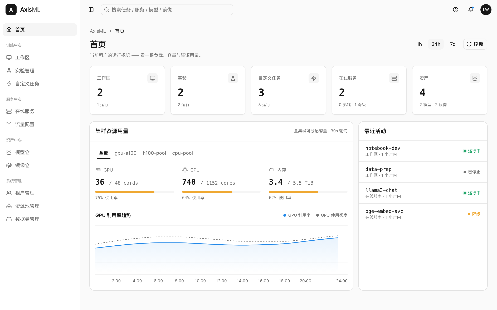

<p align="center">
  
</p>

<p align="center">
  <strong>面向机器学习全生命周期的 Kubernetes 原生平台。</strong><br>
  分布式训练 · 弹性推理 · 多租户配额调度 · 制品管理 —— 统一在同一个控制平面上。
</p>

<p align="center">
  <a href="https://github.com/AxisML/axisml/actions/workflows/ci.yml"></a>
  
  
  
  <a href="LICENSE"></a>
</p>

<p align="center">
  <a href="#为什么选择-axisml">为什么选择 AxisML</a> ·
  <a href="#架构">架构</a> ·
  <a href="#快速开始">快速开始</a> ·
  <a href="#组件">组件</a> ·
  <a href="#开发">开发</a> ·
  <a href="#文档">文档</a>
</p>

<p align="center">
  <a href="README.md">English</a> · <strong>简体中文</strong>
</p>

---

**AxisML** 是面向机器学习全生命周期的 Kubernetes 原生平台，在统一控制平面下
管理开发、分布式训练、制品、在线推理与运维。它以清晰的租户/配额模型和自研的
弹性调度器 `axisml-scheduler`（基于
[scheduler-plugins](https://github.com/kubernetes-sigs/scheduler-plugins)）帮助团队
共享 GPU 资源，并确保所有 workload 都经过统一的配额调度路径。

<p align="center">
  
</p>

> [!WARNING]
> **AxisML 正处于早期、活跃的开发阶段。** API、CRD 与 Helm values 会频繁变更，
> 且不另行通知。尚不建议用于生产环境 —— 提交之间可能出现破坏性变更。
> 详见[项目状态](#项目状态)。

## 为什么选择 AxisML

- **🏢 真正落地的多租户隔离。** 每个租户对应一个隔离的 Namespace 与一个 `ElasticQuota`。*不存在*绕过配额的调度路径 —— 每个工作负载 Pod 在构造上都被固定到 `axisml-scheduler`。
- **⚡ 弹性 GPU 共享。** ElasticQuota 让空闲算力流向需要它的人，并在资源争用时回收 —— 在不做静态切分的前提下实现高利用率。
- **🧩 可插拔的训练与推理后端。** 同一套 `MLRun`/`MLService` API 可分发到 `native`（Job / Deployment / StatefulSet + gang 调度的 `PodGroup`）、`kubeflow-trainer`（PyTorchJob / TFJob / MPIJob）、`kserve`（`InferenceService`）或 `custom`（自定义 GVK）—— 而无需改动面向用户的契约。
- **📦 一等公民的制品管理。** 模型、数据集、镜像与评估报告以 `(namespace, kind, name, version)` 寻址，底层由 OCI（zot）与 S3（RustFS）支撑。客户端直接从存储流式读写字节 —— 注册中心从不代理大块二进制数据。
- **🎛️ 声明式、分层式交付。** 三个 Helm chart（infra → system → platform），以 CRD 作为集群层面的事实来源、PostgreSQL 作为业务层面的权威来源 —— 二者之间持续协调。
- **🔬 为可测试而生。** 单元测试 + envtest/testcontainers 集成测试（外加一套手动的真实集群 e2e 套件）、在 CI 中校验的生成式 OpenAPI 规范，以及让 monorepo 保持规范的 pre-commit/pre-push 钩子。

## 架构

AxisML 分为三个可部署层，每层分别通过 Helm chart 交付，并按
**infra → system → platform** 自底向上安装。只有 Platform 层对外暴露；其下层均为
内部服务，并信任 Platform 透传的身份。

<p align="center">
  
</p>


**关键不变量**

- **`namespace` 即租户标识**，贯穿 compute-service 与 artifact-hub —— 边缘处无需额外的租户查找。
- **PostgreSQL 是权威来源，CR 是派生产物。** compute-service 拥有 `tenants` 表，并据此持续协调集群级的 `Tenant` CR；算子读取 `spec`，只写 `status`。
- **算子之间互不感知。** tenant-operator 从不读取 `MLRun`/`MLService`；compute-operator 从不读取 `Tenant`/`ElasticQuota`（它只是透传配额名称）。
- **无配额旁路。** 每个由后端派生的 Pod 都设置 `schedulerName: axisml-scheduler` 并携带 `scheduling.axisml.io/quota` 标签 —— 不存在绕过 ElasticQuota 的调度路径。
- **只有 Platform 对外暴露。** System 服务只接受内部调用，并信任 `X-Axisml-User` 身份头。

完整图景见[高层设计](docs/high_level_design.md)，各层细节见对应 README —— [Platform](axisml-platform/) · [System](axisml-system/) · [Infra](axisml-infra/)。

## 快速开始

> **前置条件：** Docker Desktop、[minikube](https://minikube.sigs.k8s.io/)、
> `kubectl`、[Helm](https://helm.sh/) 与 Go 1.26+。

```bash
# 1. 启动本地集群（minikube profile "axisml"）
make cluster-up
make cluster-status

# 2. 安装 AxisML —— 三个 chart 按依赖顺序（infra → system → platform）
make helm-install                 # 按顺序安装/升级全部三个
make helm-template                # 在本地渲染所有 chart（dry run）
make helm-uninstall               # 卸载，platform → system → infra
#   也可以逐层操作：
make -C axisml-infra helm-install # 同理：-C axisml-system / -C axisml-platform

# 3. 运行测试
make test                         # 跨所有组件的单元测试（无需集群）
make integration-test             # envtest + testcontainers 集成测试（需要 Docker）

make help                         # 列出所有可用的 target
```

如需在单台 Docker 主机上进行轻量本地体验，可以使用可选的 Standalone 发行形态：

```bash
make standalone-up               # Platform :8080，System :8090
make standalone-down
```

完整流程 —— 环境搭建、构建/测试，以及各测试分层（单元 / 集成 / `tests/` 下的黑盒 pytest 套件）—— 详见[开发工作流](docs/development_workflow.md)。

## 组件

AxisML 是按三个部署层组织的多 Go module monorepo。可选的 Standalone 发行形态
独立打包，用于单机部署。

| 组件 | 分层 | 职责 |
| --- | --- | --- |
| **[platform](axisml-platform/)** | Platform | Go BFF + React 前端。唯一对外暴露的入口；持有 用户 → 租户视图 的映射，并编排 system 层服务。_（backend 目前是仅生成契约的壳，产出 `axisml-platform/docs/apis/platform.yaml`；前端已搭好脚手架）_ |
| **[cluster-manager](axisml-system/cluster-manager/)** | System | 在集群级 `ResourcePool` CRD（含内联 `spec.units[]`）之上的无状态 REST 壳。无 PG、无 reconciler —— Kubernetes etcd 是事实来源。 |
| **[compute-service](axisml-system/compute-service/)** | System | **Tenant / Quota / Job / Service / Workspace** 的 REST 服务与业务权威，以 PG 为唯一事实来源。派生出 `Tenant` / `MLRun` / `MLService` CR 并回读其状态。 |
| **[tenant-operator](axisml-system/tenant-operator/)** | System | 将 `Tenant` CR 协调为 Namespace、`ElasticQuota`，以及每租户的 Secret / ConfigMap / ServiceAccount / RBAC。 |
| **[compute-operator](axisml-system/compute-operator/)** | System | 通过 dispatcher + handler 模型协调 `MLRun` / `MLService` / `MLTrafficPolicy`（`native`、`kubeflow-trainer`、`kserve`、`custom`）。所有派生 Pod 都经由 `axisml-scheduler`。 |
| **[artifact-hub](axisml-system/artifact-hub/)** | System | 模型、数据集、镜像与评估报告的注册中心，以 `(namespace, kind, name, version)` 寻址。PG 存元数据；字节存于 zot（OCI）与 RustFS（S3）。 |
| **[axisml-standalone](axisml-standalone/)** | 发行形态 | 顶层单机模块，包含三个 REST 模块的 composition root、Docker runtime 与 Compose 资产。 |

**基础设施**（[`axisml-infra`](axisml-infra/) chart）：Envoy Gateway、RustFS、zot、axisml-scheduler、NVIDIA GPU Operator、kube-prometheus-stack 以及 PostgreSQL。详见 [infra 设计](axisml-infra/docs/system_design/overview.md)。

## 开发

```bash
make build               # 构建所有组件
make fmt vet             # 每次提交前
make install-hooks       # pre-commit + pre-push 钩子（pre-commit 框架）
make docs-gen            # 重新生成 OpenAPI 规范与配置文档
make docs-test           # 校验生成文档与 Go 源码一致（CI 守卫）
make coverage            # 单元 + 集成覆盖率，合并到 coverage/coverage.out
```

不了解就会踩坑的点：

- **System 组件是独立 Go module。** 公共 APIs、五个可部署组件、集成测试与生成
  工具保持明确的 module 边界；使用 `make` target 遍历所有验证边界。
- 单机发行形态的代码与部署资产位于 `axisml-standalone/`。
- **生成文档不得手工修改。** 修改 handler 签名、DTO 或配置结构后，提交前运行 `make docs-gen`；`make docs-test` 是仓库级一致性检查。
- **Conventional Commits，按层加 scope** —— `feat(infra|system|platform)` 外加跨切面的 `build` / `repo` / `deps`；由 commitlint 在提交与 PR 标题上强制执行。
- **算子引入的外部 CRD**（scheduler-plugins 的 `ElasticQuota` 与 `PodGroup`……）已 vendored 到 `axisml-system/test/crds/external/`。

架构说明与坑点见 [CLAUDE.md](CLAUDE.md)；贡献者约定见 [AGENTS.md](AGENTS.md) 与 [CONTRIBUTING.md](CONTRIBUTING.md)。

## 文档

- **[高层设计](docs/high_level_design.md)** —— 从这里开始（核心概念、特性矩阵、完整架构）
- **按层** —— [Platform](axisml-platform/) · [System](axisml-system/) · [Infra](axisml-infra/)
- **可选单机部署** —— [Standalone](axisml-standalone/)
- **跨切面** —— [部署手册](docs/deployment.md) · [开发工作流](docs/development_workflow.md)（各层 DB schema 位于各自的 `<layer>/docs/system_design/database.md`）
- **OpenAPI 规范** —— 各归属目录 `docs/apis/` 下生成的 REST 契约（[system](axisml-system/docs/apis) · [platform](axisml-platform/docs/apis) · [standalone](axisml-standalone/docs/apis)）
- **前端设计体系** —— [DESIGN.md](DESIGN.md)（Vercel Geist 风格）

## 项目状态

AxisML 正处于**早期、活跃的开发阶段**。系统设计先于代码 —— 当代码与设计文档不一致时，设计文档通常代表预期目标。当前的设计覆盖范围见[特性矩阵](docs/high_level_design.md)。

## 贡献

欢迎贡献！在提交 PR 之前：

1. 阅读 [CONTRIBUTING.md](CONTRIBUTING.md) 与 [AGENTS.md](AGENTS.md)，了解提交规范（Conventional Commits）与 PR 期望。
2. 每个 clone 执行一次 `make install-hooks` —— 钩子会强制执行格式化、vet 以及文档/规范同步。
3. 确保 `make test` 通过；为新行为在单元测试之外补充一条集成 happy-path。

## 许可证

AxisML 采用 [Apache License 2.0](LICENSE) 许可。提交 Pull Request 即表示你同意你的贡献依据 Apache 2.0 授权（依据该许可证第 5 节）。
