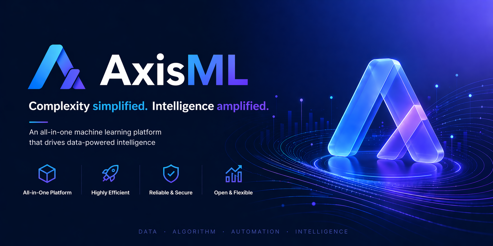
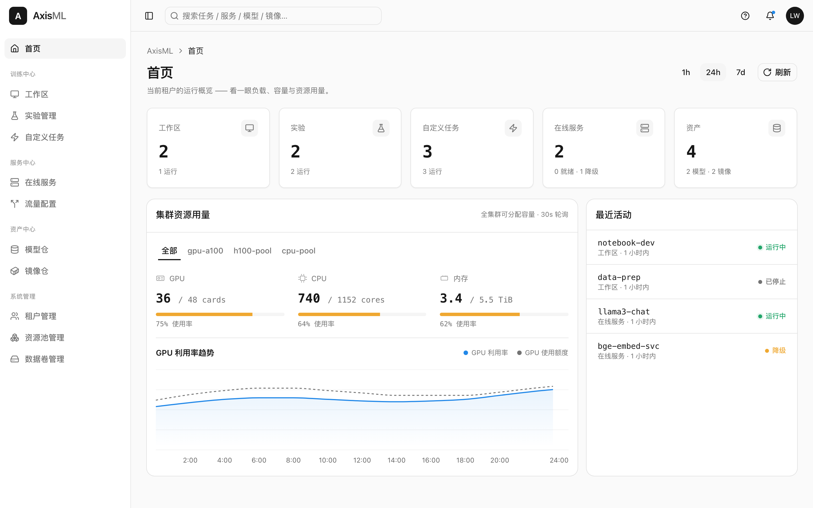
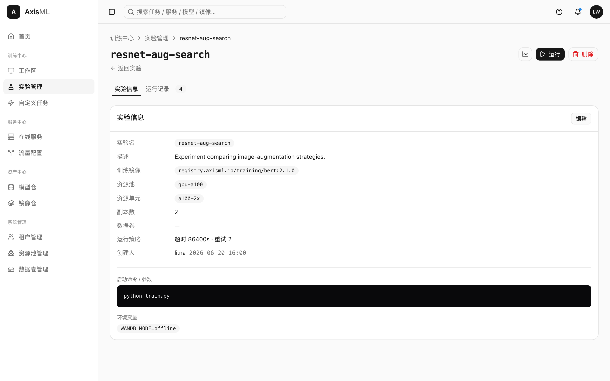
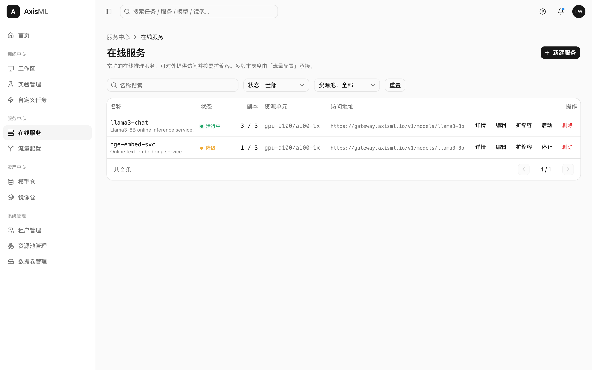
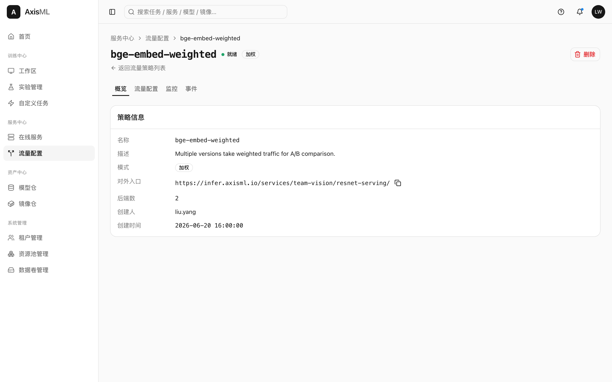
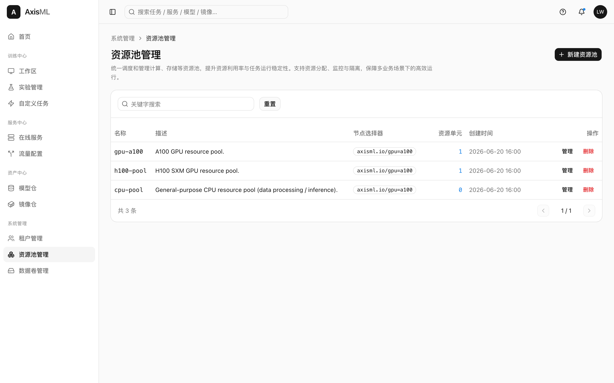

<p align="center">
  
</p>

<p align="center">
  <strong>面向共享 GPU 团队的开源机器学习平台。</strong><br>
  工作区 · 分布式训练 · 在线推理 · 模型与镜像仓库 · 多租户配额 —— 一个控制平面，可运行在 Kubernetes 或单台 Docker 主机上。
</p>

<p align="center">
  <a href="https://github.com/AxisML/axisml/actions/workflows/ci.yml"></a>
  
  
  
  <a href="LICENSE"></a>
</p>

<p align="center">
  <a href="#-亮点">亮点</a> ·
  <a href="#-快速开始">快速开始</a> ·
  <a href="#-功能">功能</a> ·
  <a href="#-架构">架构</a> ·
  <a href="#-文档">文档</a> ·
  <a href="#-参与贡献">参与贡献</a>
</p>

<p align="center">
  <a href="README.md">English</a> · <strong>简体中文</strong>
</p>

---

**AxisML** 为机器学习团队提供在共享 GPU 基础设施上开发、训练、版本化和部署模型的
统一入口。平台管理员把集群划分为资源池和租户配额；算法工程师在 Web 控制台中使用
工作区、实验、任务和推理服务 —— 所有 workload 都经过同一条强制配额的调度路径，
任何团队都无法挤占其他团队的资源。

<p align="center">
  
</p>

> [!WARNING]
> **AxisML 正处于早期、活跃的开发阶段。** API、CRD 与 Helm values 可能在提交之间
> 不经通知地变更。适合评估与参与贡献，尚不建议用于生产环境。

## ✨ 亮点

| | |
| --- | --- |
| 🏢 **真正落地的多租户隔离** | 每个租户拥有独立的作用域和按资源池划分的配额。所有 workload Pod 在构造时即绑定 `axisml-scheduler` —— **不存在绕过配额的调度路径**。 |
| ⚡ **弹性 GPU 共享** | 基于 [scheduler-plugins](https://github.com/kubernetes-sigs/scheduler-plugins) 的 `ElasticQuota`：空闲算力可借给有需要的租户，资源紧张时再回收 —— 无需静态切分即可获得高利用率。分布式任务通过 `PodGroup` 实现 gang 调度。 |
| 🧩 **一套 API，可插拔引擎** | 统一的 `MLRun` / `MLService` 契约可分发到原生 Kubernetes（Job、Deployment、StatefulSet）、**Kubeflow Trainer**（PyTorchJob / TFJob / MPIJob）、**KServe** 或任意自定义 CRD —— 切换后端无需改变用户提交方式。 |
| 🚦 **开箱即用的金丝雀与蓝绿发布** | `MLTrafficPolicy` 在多个模型服务前提供一个稳定入口，并通过 Envoy Gateway 按权重分发流量。 |
| 📦 **内置制品仓库** | 模型、镜像和数据集按租户进行版本管理，存储于 OCI（zot）与 S3（RustFS）。客户端直连存储读写，仓库从不代理大文件。 |
| 🐳 **Kubernetes 或单台 Docker 主机** | 同一产品提供两种部署形态：面向集群的三个 Helm chart，或以 Docker 容器运行 workload 的 Compose 栈。UI、API、测试套件完全相同。 |

## 🚀 快速开始

### 方式一 —— 单机体验（Standalone，约 5 分钟）

只需要 **Docker** 和 **make**。

```bash
git clone https://github.com/AxisML/axisml.git && cd axisml
make standalone-up        # 构建镜像并启动 Compose 栈
```

打开 **http://localhost:8080**，使用 `admin` / `admin` 登录（首次登录会要求修改密码）。
内部 System API 监听在 `:8090`。

```bash
make standalone-down              # 停止（CLEAN=1 同时删除数据卷）
make standalone-delete            # 清除整个栈及所有 AxisML 托管的容器 / 数据卷
```

可选组件：`make standalone-up PROFILES="storage gateway"` 会额外启动 RustFS（S3）
和用于服务路由的 Envoy Gateway。GPU 配置与运行时限制见
[Standalone 指南](axisml-standalone/)。

### 方式二 —— 部署到 Kubernetes

> **前置依赖：** Docker、[minikube](https://minikube.sigs.k8s.io/)（或任意集群）、
> `kubectl` 与 [Helm](https://helm.sh/)。

```bash
make cluster-up           # 本地 minikube 集群（profile "axisml"）；已有集群可跳过
make helm-install         # 按 infra → system → platform 顺序安装三个 chart
make helm-uninstall       # 按相反顺序卸载
```

values 配置、镜像 tag、分层安装与生产注意事项见[部署手册](docs/deployment.md)。

### Kubernetes 与 Standalone 对比

| | Kubernetes | Standalone |
| --- | --- | --- |
| 适用场景 | 多节点共享 GPU 集群 | 评估、开发机、单台 GPU 服务器 |
| 交付方式 | 3 个 Helm chart（infra / system / platform） | 1 个 Docker Compose 项目 |
| Workload 运行方式 | 经 `axisml-scheduler` + ElasticQuota 调度的 Pod | 内置配额准入的 Docker 容器 |
| 训练 / 推理引擎 | native、Kubeflow Trainer、KServe、custom | native（job / deployment / statefulset） |
| UI、API、数据模型 | ✅ 完全一致 | ✅ 完全一致 |

## 🧭 功能

| 领域 | 能力 |
| --- | --- |
| **训练** | 工作区（交互式开发环境）、带运行历史与 TensorBoard 的实验、可复用的任务模板、优先级排队、分布式训练 |
| **推理服务** | 支持部分上线与扩缩容的在线推理服务，按权重分流的金丝雀 / 蓝绿流量策略 |
| **资产** | 版本化的模型与容器镜像仓库，支持租户私有或公开可见 |
| **系统管理** | 租户与成员（system-admin / tenant-admin / user 三级角色）、资源池与资源单元、按资源池配额、数据卷、集群仪表盘 |

<table>
  <tr>
    <td><p align="center"><sub>实验与运行</sub></p></td>
    <td><p align="center"><sub>推理服务</sub></p></td>
  </tr>
  <tr>
    <td><p align="center"><sub>流量分发</sub></p></td>
    <td><p align="center"><sub>资源池与配额</sub></p></td>
  </tr>
</table>

## 🏗 架构

AxisML 分为三层。只有 **Platform** 层对用户暴露，其下各层均为内部服务。

<p align="center">
  
</p>

| 层 | 组件 | 职责 |
| --- | --- | --- |
| **Platform** | [backend + frontend](axisml-platform/) | 唯一对外入口：React 控制台、REST API、认证与 RBAC、租户视图，以及任务 / 实验 / 模型定义。 |
| **System** | [cluster-manager](axisml-system/cluster-manager/) · [compute-service](axisml-system/compute-service/) · [artifact-hub](axisml-system/artifact-hub/) · [tenant-operator](axisml-system/tenant-operator/) · [compute-operator](axisml-system/compute-operator/) | 控制面：资源池与租户、workload 准入与生命周期、制品元数据，以及把 `Tenant` / `MLRun` / `MLService` / `MLTrafficPolicy` CR 落地为实际资源的 operator。 |
| **Infra** | [axisml-infra](axisml-infra/) | PostgreSQL、`axisml-scheduler`、Envoy Gateway、zot（OCI）、RustFS（S3）、NVIDIA GPU Operator、kube-prometheus-stack。 |

贯穿全局的设计原则：

- **不可绕过配额。** 所有 backend 派生的 Pod 都设置 `schedulerName: axisml-scheduler` 并带有 `scheduling.axisml.io/quota` label。
- **PostgreSQL 是权威，CR 是派生。** 服务持久化期望状态并据此调谐 CR；operator 只读 `spec`、只写 `status`。
- **Operator 松耦合。** `tenant-operator` 与 `compute-operator` 互不读取对方的资源。
- **部署形态不是产品分叉。** Kubernetes 与 Standalone 只替换资源 provider 和运行时；领域逻辑、OpenAPI 与 UI 只有一份。

完整设计见[高层设计](docs/high_level_design.md)。

## 📚 文档

| 主题 | 位置 |
| --- | --- |
| 系统概览 —— 核心概念、不变量、功能矩阵 | [高层设计](docs/high_level_design.md) |
| 安装与配置 | [部署手册](docs/deployment.md) · [配置参考](docs/configuration.md) · [Standalone](axisml-standalone/) |
| 分层设计 | [Platform](axisml-platform/) · [System](axisml-system/) · [Infra](axisml-infra/) |
| REST API（生成的 OpenAPI） | [Platform](axisml-platform/docs/apis) · [System](axisml-system/docs/apis) · [Standalone](axisml-standalone/docs/apis) |
| 构建、测试与贡献 | [开发流程](docs/development_workflow.md) · [CONTRIBUTING.md](CONTRIBUTING.md) |
| 前端设计系统 | [DESIGN.md](DESIGN.md) |

## 🛠 开发

AxisML 是一个 Go 1.26 monorepo（每个组件为独立 module），前端为 React + TypeScript，
黑盒测试套件基于 Python/pytest。

```bash
make help                 # 列出所有 target
make build                # 构建全部 Go 组件
make test                 # 单元测试（无需集群）
make integration-test     # envtest + testcontainers 集成测试（需要 Docker）
make docs-gen             # 修改 DTO 后重新生成 OpenAPI 规格与配置文档
make install-hooks        # 安装 pre-commit / pre-push hooks
```

环境搭建、测试分层以及 [`tests/`](tests/) 中的黑盒 API / UI 测试套件，见
[开发流程](docs/development_workflow.md)。

## 🗺 项目状态

AxisML 正处于**早期、活跃的开发阶段** —— 设计文档领先于代码实现。
路线图包括：控制台中的数据集管理、模型评估、模型定制以及 OIDC 登录。当前设计
覆盖情况见[功能矩阵](docs/high_level_design.md)。

## 🤝 参与贡献

欢迎任何形式的贡献 —— 问题反馈、文档或代码。

1. 阅读 [CONTRIBUTING.md](CONTRIBUTING.md) 与 [AGENTS.md](AGENTS.md)（Conventional Commits，scope 为 `infra` / `system` / `platform`）。
2. 每个 clone 执行一次 `make install-hooks`。
3. 确保 `make test` 通过；新增行为需同时提供集成测试 happy-path。

请遵守[行为准则](CODE_OF_CONDUCT.md)，安全问题请按 [SECURITY.md](SECURITY.md) 私下报告。

## 📄 许可证

AxisML 基于 [Apache License 2.0](LICENSE) 授权。
